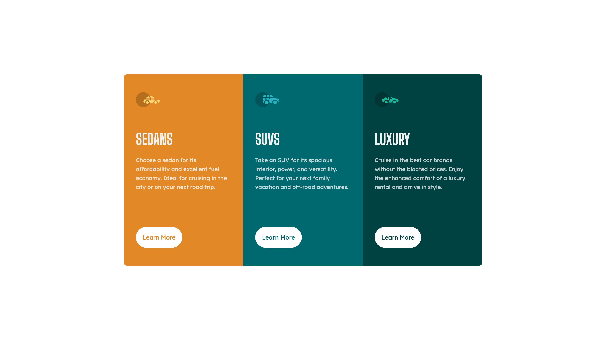
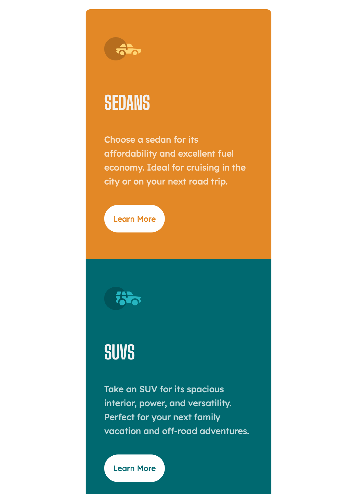

# Frontend Mentor - 3-column preview card component solution

This is a solution to the [3-column preview card component challenge on Frontend Mentor](https://www.frontendmentor.io/challenges/3column-preview-card-component-pH92eAR2-). Frontend Mentor challenges help you improve your coding skills by building realistic projects.

## Table of contents

- [Overview](#overview)
  - [The challenge](#the-challenge)
  - [Screenshot](#screenshot)
  - [Links](#links)
- [My process](#my-process)
  - [Built with](#built-with)
  - [What I learned](#what-i-learned)
  - [Continued development](#continued-development)
- [Author](#author)
- [Acknowledgments](#acknowledgments)

**Note: Delete this note and update the table of contents based on what sections you keep.**

## Overview

### The challenge

Users should be able to:

- View the optimal layout depending on their device's screen size
- See hover states for interactive elements

### Screenshot




Mobile version has a scrollable view.

### Links

- Solution URL: [GitHub](https://github.com/LySabrina/3-Column-Card)
- Live Site URL: [Live Site](https://lysabrina.github.io/3-Column-Card/)

## My process

### Built with

- Semantic HTML5 markup
- CSS custom properties
- Flexbox
- Mobile-first workflow

### What I learned

In this project, I used a lot of ems and percentages for the widths. I struggled with the placement of the margin between the button and description spacing. The line placement of the buttons are not center aligned depending on the screen size of desktop mode.

This may be because I was using `min-height` which states that I should have at least some n-height and grow if the content inside the container demands it. So I change it to `max-width` such that it can not grow larger than N-height. By doing this, all the cards are not the same height and I was able to achieve some same height placement of the buttons.

```css
.card {
  /* min-height: 20em; */
  max-height: 40em;
}
.card__btn {
  margin-top: 25%;
}
.card__title {
  font-size: 2.5rem;
  margin-bottom: 1em;
}
```

### Continued development

No continued development is needed for this project.

## Author

- Frontend Mentor - [@lysabrina](https://www.frontendmentor.io/profile/LySabrina)
- GitHub - [@lysabrina](https://github.com/LySabrina)

## Acknowledgments

Thanks to FrontendMentor for this project and me!
